## 2

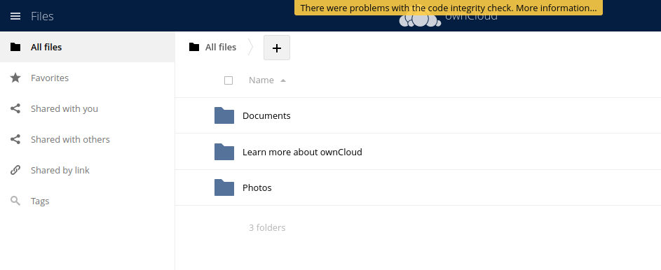.
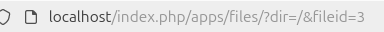.


# 3 

# Instal·lació i configuració de aplicacions web
Avui us ensenyare a descargar una aplicació, pero fent que funcioni amb tots els codis següents, necessitarem
codis del terminal perque funcioni l'aplicació
Primer instalarem làplicació al director.
## Instalarem la versio 7.4 de Php a UBuntu

#### Aquest son els requisits previs de PPA
```bash
sudo apt install software-properties-common -y
```
#### Despres instalem les eines per treballar en els arxius personals
```bash
LC_ALL=C.UTF-8 sudo add-apt-repository ppa:ondrej/php -y
```
#### Ara descarregarem la llibreria de Php de la versió 7.4
```bash
sudo apt install php7.4 -y
```
```bash
sudo apt install -y php libapache2-mod-php7.4
```

```bash
sudo apt install -y php7.4-fpm php7.4-common php7.4-mbstring php7.4-xmlrpc php7.4-soap php7.4-gd php7.4-xml php7.4-intl php7.4-mysql php7.4-cli php7.4-ldap php7.4-zip php7.4-curl
```
Seleccionem la versió que en aquest cas es la 2
```bash
sudo update-alternatives --config php
```

Activem el modul d'apache:
```bash
sudo a2enmod proxy_fcgi setenvif
```
```bash
sudo a2enconf php7.4-fpm
```
I per ultim reiniciem l'apache2:
```bash
sudo service apache2 restart
```

## Instal·lació d'apache2, mysql i algunes llibreries al contenidor

1. Primer actualitzem la maquina.
```console
sudo apt update
```
.
```console
sudo apt upgrade
```
.

2. Segon instalem el servidor web `apache2`.
```console
sudo apt install -y apache2
```
.


3. Tercer instalem la base de dates al servidor `mysql-server`.
```console
sudo apt install -y mysql-server
```
.

4. Instalem les llibreries de `php`, i el llenguatge de les aplicacions.
```console
sudo apt install -y php libapache2-mod-php
```
```console
sudo apt install -y php-fpm php-common php-mbstring php-xmlrpc php-soap php-gd php-xml php-intl php-mysql php-cli php-ldap php-zip php-curl
```Captura de pantalla de 2024-11-12 08-27-46.png
.

5. Ara reiniciem el servidor apache2 i seguim amb les comandes en el terminal
```console
sudo systemctl restart apache2 
```
```console
sudo mysql
```
.

## Configuració de MySQL
### Creació base de dates
Dins de el MySQL tens que posar aquestes comandes de creació de dates, de usuaris i sortim de la base.
```console
CREATE DATABASE bbdd;
```
```console
CREATE USER 'usuario'@'localhost' IDENTIFIED WITH mysql_native_password BY 'password';
```
```console
GRANT ALL ON bbdd.* to 'usuario'@'localhost';
```
```console
exit
```

.

## Descarrega de fitxers de l'aplicacoó web

Anem al directori `/var/www/html` i mirem el nombre del fitxer que acaben de descarregar i substituim per `app-web.zip` per el nom del nostre fitxer que hem descarregat amb l'aplicació web. Si esta en castella dons seria Descargas no Baixades i posem usuari

```console
sudo cp ~/Baixades/app-web.zip /var/www/html
```
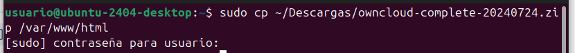.

Ara anem al directori `/var/www/html` i descomprimim el fitxer que hem baixat
```console
cd /var/www/html
```

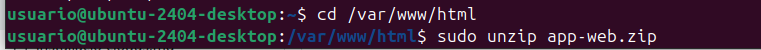.


Copiem els fitxers a la carpeta `/var/www/html`, i canviem `app-web` pel el nom del nostre directori, despres eliminimen la carpeta que hem creat de l'unzip
```console
sudo cp -R app-web/. /var/www/html
```
```console
sudo rm -rf app-web/
```


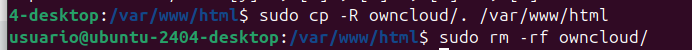.

## Eliminem el nostre fitxer `index.html` de l'`apache2`
```console
sudo rm -rf /var/www/html/index.html
```

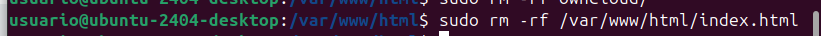.

## Aplicació de permisos a les nostres aplicacions web
Despres de comprimir els fitxers de l'aplicació de la web `/var/www/html`, apliquem altres permisos ver que funcionin`/var/www/html`

```console
cd /var/www/html
```
```console
sudo chmod -R 775 .
```
```console
sudo chown -R usuario:www-data .
```

## Ja podem veure si l'aplicació funciona
Poseu la direcció http://localhost al navegador web i configureu la cloud.

# Aqui estan les claus que es necessiten

* **usuari:** usuario
* **contrasenya:** password
* **base de dades:** bbdd
* **domini:** localhost

## 4
### Aqui he pujat un arxiu
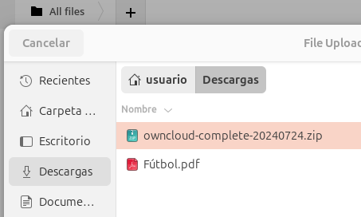.
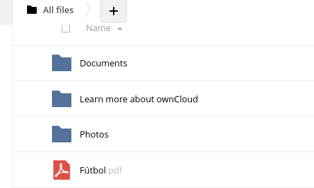.

### He creat una carpeta que es diu Futboleros
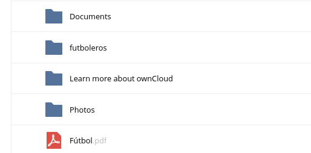.
### Tambe puc compartir nomes que no tinc ningun grup encara
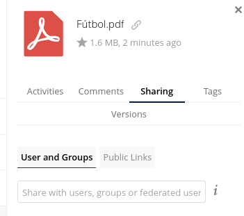.

## 5

### He creat 3 usuaris (admin, editor y visualizador)
#### Primer he creat un grup per ficar dintre els usuaris, el primer a segut l'editor

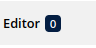
#### En aquest cas despres de posar el email i el nom he clicat en la opció de editor
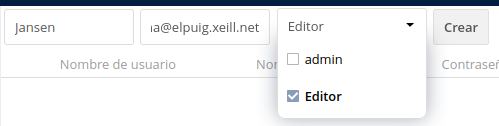
#### I aixi quedaria
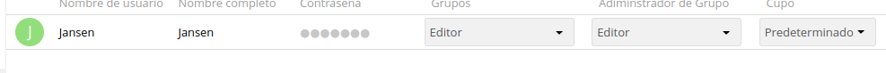
#### I he fet el mateix amb el visualizador, en aquest cas es diu Roberto

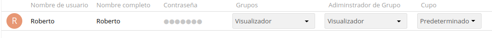
#### Al final ens quedaria aixi els tres tipus
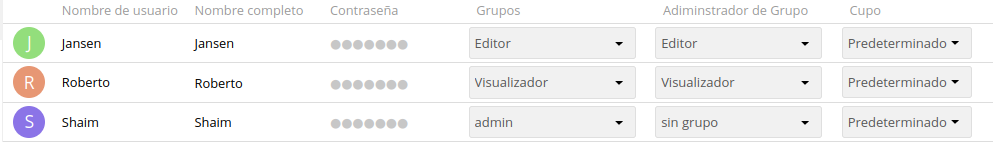
## 6
#### El admin pot controlar tot, pot compartir amb altres persones pot eliminar tots els usuaris que estiguin dintre, despres els editors no tenen permis pero tocar els altres comptes ja que allo nomes ho pot fer l'administrador, els editors el que fan es que poden tocar els PDF, els arxius, les carpetes y modificarles i per ultim els visualizador no poden fer mes que mirar tot el que hi ha, com el PDF mateix ho pott obrir i mirar, tampoc poden configurar les carpetes

## 7

#### He organitzat un carpeta que he creat que es diu "moure", que al he ficat dintre de photos
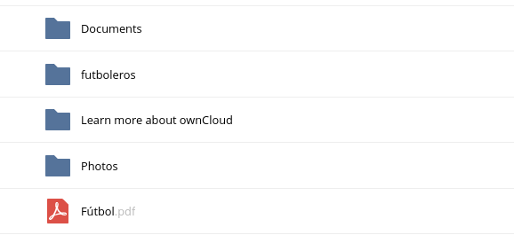
#### I aqui esta dintre
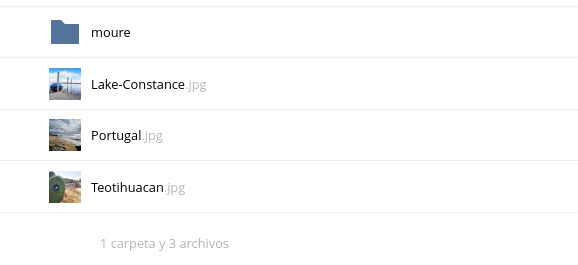
#### Configuració dels enllaços
#### He escollit el Pdf de futboleros, i com no tenia un enllaç he creat un
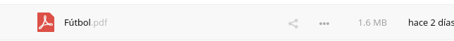
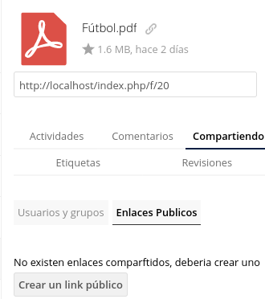
#### Aqui esta les dades
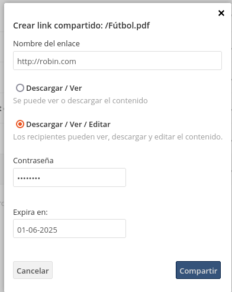
#### Ara si vui configurar la caducitat tinc que clicar el signe de configuració "setting"

#### I ja abaix puc canviar la caducitat
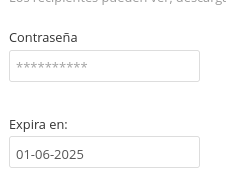

## 8


