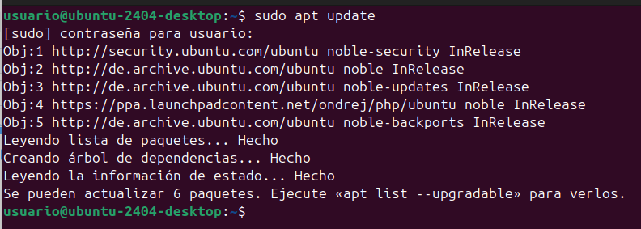
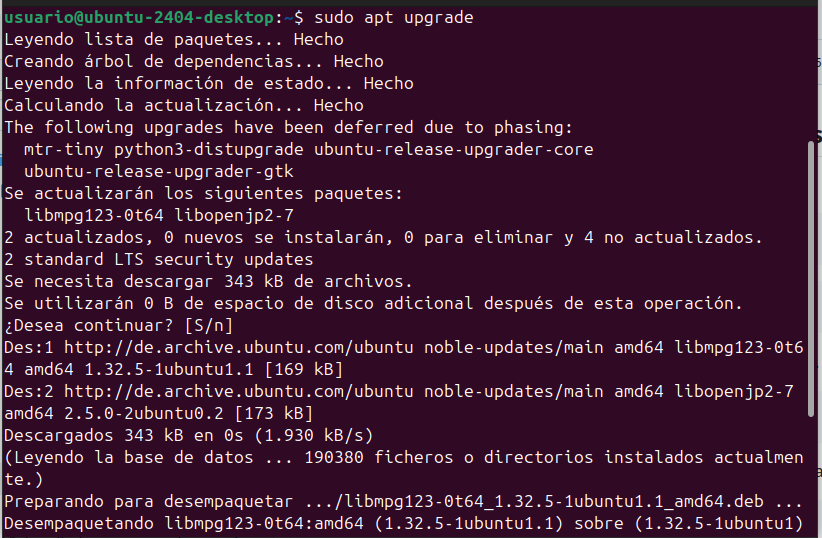
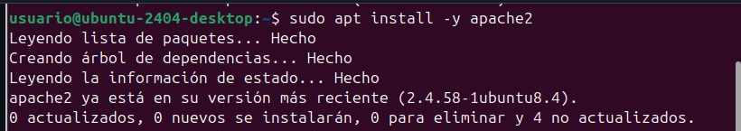
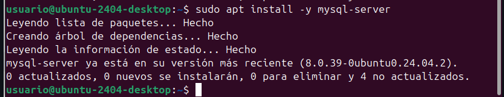
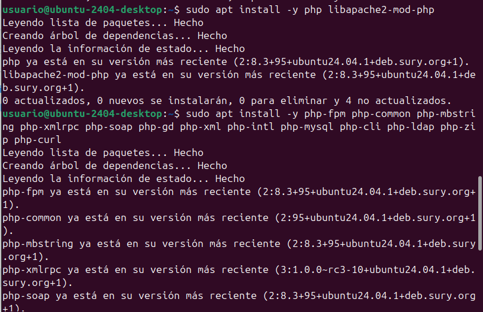
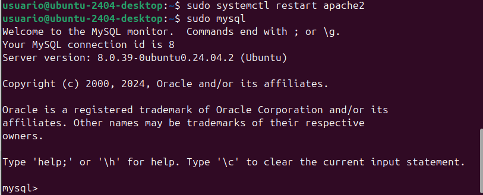
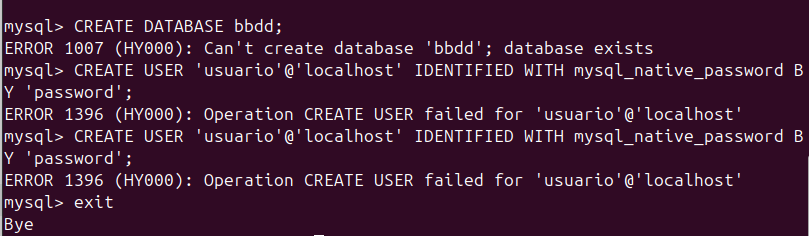

# Instal·lació i configuració de aplicacions web
Avui us ensenyare a descargar una aplicació, pero fent que funcioni amb tots els codis següents, necessitarem
codis del terminal perque funcioni l'aplicació
Primer instalarem làplicació al directori

## Instal·lació d'apache2, mysql i algunes llibreries al contenidor

1. Primer actualitzem la maquina.
```console
sudo apt update
```
.
```console
sudo apt upgrade
```
.

2. Segon instalem el servidor web `apache2`.
```console
sudo apt install -y apache2
```
.


3. Tercer instalem la base de dates al servidor `mysql-server`.
```console
sudo apt install -y mysql-server
```
.

4. Instalem les llibreries de `php`, i el llenguatge de les aplicacions.
```console
sudo apt install -y php libapache2-mod-php
```
```console
sudo apt install -y php-fpm php-common php-mbstring php-xmlrpc php-soap php-gd php-xml php-intl php-mysql php-cli php-ldap php-zip php-curl
```
.

5. Ara reiniciem el servidor apache2 i seguim amb les comandes en el terminal
```console
sudo systemctl restart apache2 
```
```console
sudo mysql
```
.

## Configuració de MySQL
### Creació base de dates
Dins de el MySQL tens que posar aquestes comandes de creació de dates, de usuaris i sortim de la base.
```console
CREATE DATABASE bbdd;
```
```console
CREATE USER 'usuario'@'localhost' IDENTIFIED WITH mysql_native_password BY 'password';
```
```console
GRANT ALL ON bbdd.* to 'usuario'@'localhost';
```
```console
exit
```

.


